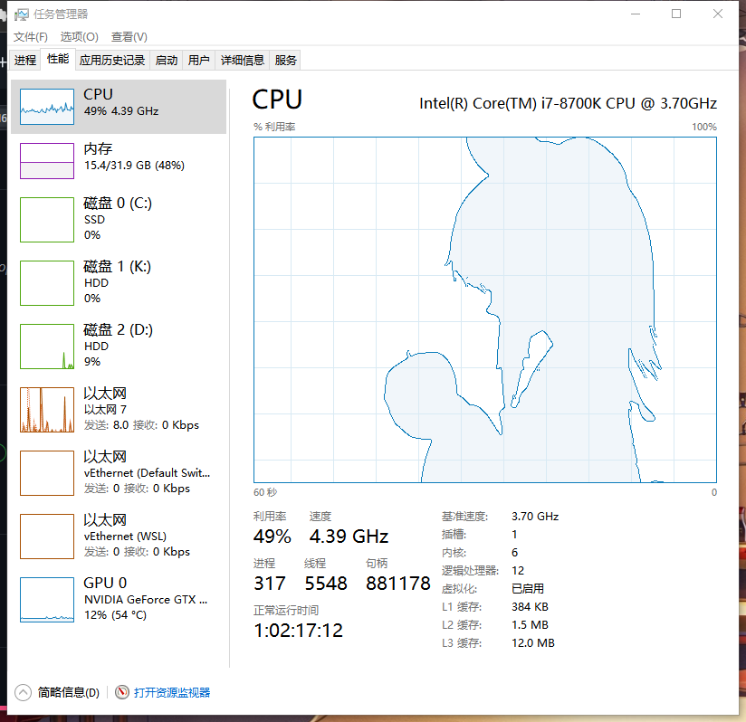

you need to configure opencv and ffmpeg running environments on your computer, and then run exe files as an administrator before the programs can run in task manager.

After trying the program can be in the CPU and Ethernet windows to achieve animation playback,

i always thought ffmpeg was a very tall thing. i learned it from ffmpeg's source code at the beginning, but the more i learned, the more i felt ffpeg was boring. at first, learning source code was not a very good way to learn.

The correct way to learn is to apply ffmpeg directly to the program and run ffmpeg as a command.

In fact, do not need to understand too much development source code, do research and development is needed.

Anyway, getting your code moving is learning the right way to open ffmpeg, not obsessing about the details of the source code, and you don't do library development, right?

The download address of opencv and ffmpeg is attached:
1. [opencv](https://opencv.org/releases/)
2. [ffmpeg](https://www.gyan.dev/ffmpeg/builds/)

------------

# TaskmgrPlayer
 >让你的任务管理器动起来

 

 这个程序原本是为了在任务管理器的CPU性能图上播放BadApple而写出来的
 经过一些改进之后, 现在可以在任何你想要的窗口上播放任何视频!

 ## config.cfg
通过配置config.cfg可以更改一些效果  
该文件默认使用utf8编码  
更改目标显示窗口需要了解Windows窗口的组成结构并学会使用Spy++来获得目标窗口的路径.  
播放的视频默认使用二值化后边缘检测的后处理, 想要实现其他效果需要自行修改代码并编译, 或者可以提交Issue, 我之后会添加.
颜色格式采用BGR格式

- WindowName 窗口标题
- WindowClass 窗口类
- ChildName 子窗口的类  使用了同一个类的租窗口, 默认选择最大的那一个
- ColorEdge 边缘的颜色
- ColorDark 二值化后黑色转换成的原色
- ColorBright 二值化后白色转换的颜色
- ColorGrid 背景网格的颜色
- ColorFrame 外围边框的颜色

## 其他
之后会在B站传一个视频教程(大概吧)
